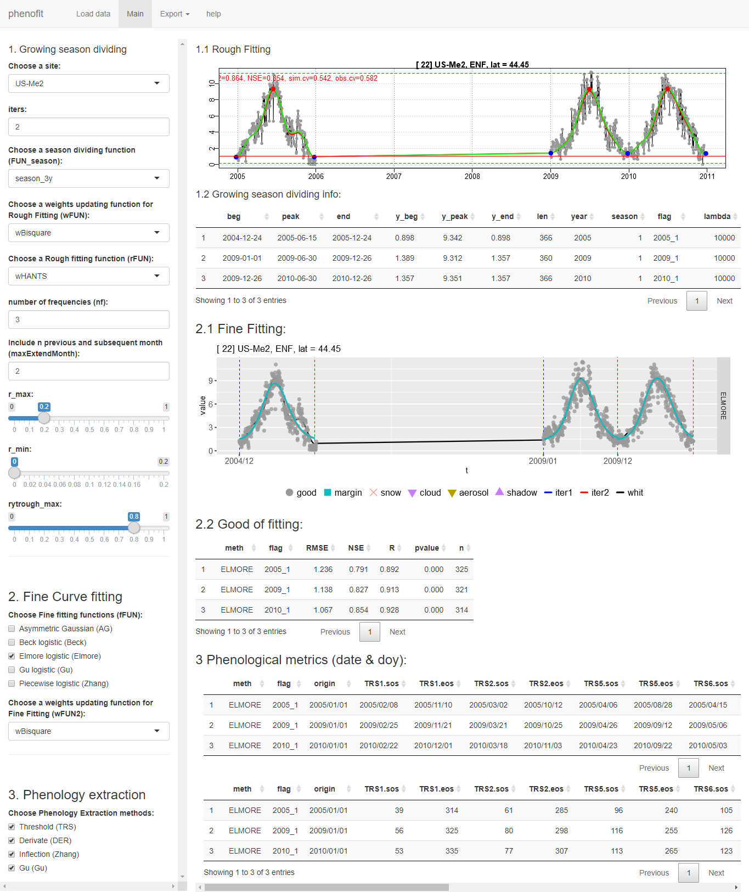

# phenofit.shiny

<!-- badges: start -->
<!-- badges: end -->

The goal of phenofit.shiny is to ...

## Installation

``` r
install.packages("phenofit")
devtools::install_github("kongdd/phenofit.shiny")
```

## Example

This is a basic example which shows you how to solve a common problem:

``` r
library(phenofit.shiny)
## basic example code
shiny::runApp(system.file("phenofit", package = "phenofit"))
```

   


# **References** 
> [1\] Dongdong Kong, R package: A state-of-the-art Vegetation Phenology extraction package, `phenofit` version 0.2.2, <https://github.com/kongdd/phenofit>

# Acknowledgements

Keep in mind that this repository is released under a GPL3 license, which permits commercial use but requires that the source code (of derivatives) is always open even if hosted as a web service.
